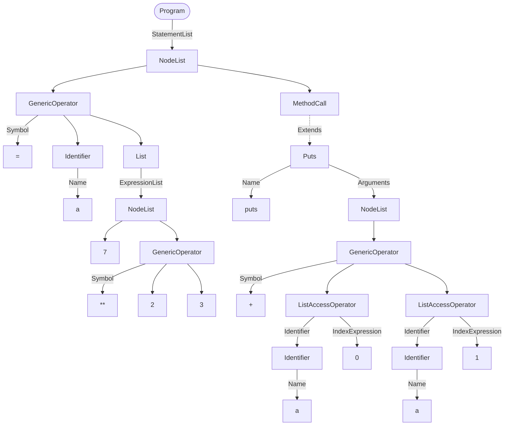

# Translator Ruby to JavaScript

Translator written in Python, which allows you to convert your Ruby code into JavaScript code. A sample conversion:


## Table of contents

- [Introduction](#translator-ruby-to-javascript)
- [Manual](#manual)
- [Technology](#technology)
- [How it works](#how-it-works)
  - [AST tree showcase](#ast-tree-showcase)
- [Components](#components)

## Manual

To run the translator you will need:
* python3
* [PLY](https://pypi.org/project/ply/) library. You can install it using
```
pip install ply
```
* [jsbeautifier](https://pypi.org/project/jsbeautifier/) library. You can install it using

```
pip install jsbeautifier
```

Prepare a Ruby file and run the translator using
```
python translator.py PATH_TO_FILE
```

The program will execute translation and it will create a file `out.js` in the main directory. This is the output JavaScript program.

## Technology
The translator was implemented using Python 3 and two libraries:

[PLY](https://pypi.org/project/ply/) - the library used in order to parse Ruby using python's implementation of lex and yacc LALR(1) parser.

[jsbeautifier](https://pypi.org/project/jsbeautifier/) - the library used for beautifying the output code.

## How it works
The translator reads an input file written in Ruby. Every component required by PLY library is defined within `tree_builder`. It includes lexer and yacc definitions i.e. tokens, grammar, operator precedence and actions responsible for building an AST tree.

Each token is declared within the `tokens` array and the corresponding regular expressions are defined as variables named `t_TOKEN_NAME` or as methods with the same names. These methods take a token as an argument and include a docstring determining the regex. Inside the method you can execute required operations like casting token's value to desired type. A method should return token.

Example method handling BOOLEAN tokens:

``` python
def t_BOOLEAN(t):
    r'true|false'
    t.value = bool(t.value)
    return t
```

Next we create a lexer.

```
lexer = lex.lex()
```

Similarly we prepare the parser. It consists of methods named `p_NAME`. Just like with tokens, this method includes a docstring which represents a part of a grammar. A complete grammar can be constructed using all of these methods.

Example method defining simple arithmetic and boolean operators:

``` python
def p_expression(p):
    '''
    expression : expression MULTIPLY expression
               | expression DIVIDE expression
               | expression PLUS expression
               | expression MINUS expression
               | expression POWER expression
               | expression MODULO expression
               | expression AND expression
               | expression OR expression
    '''

    # p[0], p[1] ... are the distinct parts in the above grammar (eg. p[2] is an operator token)
    p[0] = OperatorFactory.get(p[2], p[1], p[3]) # creates node in an AST tree
```

In the `syntax_tree.nodes` there are nodes which will be used to build an AST tree. In the above method we are using an `OperatorFactory` to generate a proper node. As most of the operators are shared between both Ruby and JavaScript `OperatorFactory` usually generates a `GenericOperator` with a proper symbol.

Example `Identifier` node:

```python
class Identifier:
    def __init__(self, name):
        self.name = name

    def __str__(self):
        out = "Identifier("
        out += "Name: " + str(self.name)
        out += ")"
        return out

    def toJavaScript(self):
        return self.name
```

After AST tree has been created, `toJavaScript()` method is called on the root node of the tree. Thanks to the recursive call of that method each node converts its children to JavaScript, meaning the root node's method outputs a complete converted code.


Ultimately, for better readability, the output code is processed by `jsbeautifier`.

### AST tree showcase

Here is a simple program and its AST tree represented as flowchart

Input:
``` ruby
a = [7, 2**3]
puts a[0] + a[1]
```
Output:
``` javascript
a = [7, 2 ** 3]
console.log(a[0] + a[1])
```

AST tree:
    



## Components
 
`translator.py` - main executable which takes path to a Ruby file as input and then passes it to `tree_builder.py`. Next it converts the tree to JavaScript and beautifies the code and saves it into `out.js` file.

`build_tree.py` - creates an AST tree using lexer and parser and defined grammar rules.

Recognized elements of language:
* arithmetic operations
* boolean operations
* methods and method calls
* if..else blocks
* while loops
* array declarations and array access operators
* classes
  * methods and constructors
  * instance variables
  * instance creation

nodes - classes defining AST tree components. Each node implements a `toJavaScript()` method which converts it to JavaScripts.

sample folder - includes sample conversion showcases.
